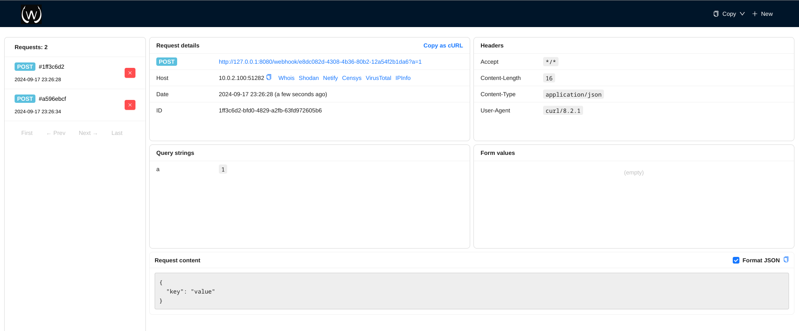

# Webhook

Simple Request Viewer based on Go and React



## Table of Contents

* [About](#about)
* [Features](#features)
* [Docker Image](#docker-image)
* [Configuration](#configuration)

## About

Webhook is a simple request viewer built with Go and React. It allows you to visualize and inspect incoming requests to your server.

## Features

* **Request Inspection**: View incoming requests in real-time
* **Redis Backend**: Use Redis for scalable request storage and processing

## Docker Image

A pre-built Docker image is available on Docker Hub. You can pull and run it with the following commands:

```bash
docker run -p 8080:8080 dessolo/webhook:latest
```

### Using Redis Backend

To enable Redis for request storage and processing, ensure you have Redis installed and running. You can configure the Redis connection in the `config.yml` file.

To start Redis using Docker:

```bash
docker run -d -p 6379:6379 redis